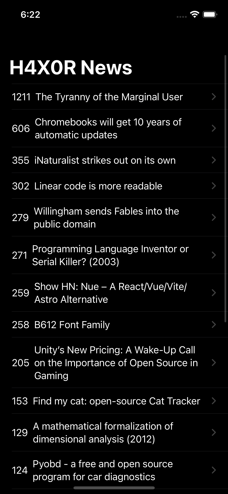

# H4X0R-News

## Summary

H4X0R-News is an iOS app that fetches and displays Hacker News articles from Y Combinator using the hn.algolia.com/api. Users can browse through the list of articles, click on them to view the full content within the app, and stay updated with the latest tech-related news.

## Technologies Used

- SwiftUI: A modern declarative UI framework used to build the app's user interface.
- Combine: A framework for handling asynchronous events and data flow.
- URLSession: Used to make network requests to fetch Hacker News data from the API.
- JSONDecoder: Used to parse the JSON data received from the API.
- WKWebView: Used to display the full content of the articles within the app.
- UIKit: Used for additional UI components and features.

## Screenshots

<table>
  <tr>
    <td align="center">
       
      Dark Mode Landing Screen
    </td>
    <td align="center">
       
      Redirect to the news article
    </td>
  </tr>
</table>

## Features

- Fetches and displays Hacker News articles using the [hn.algolia.com/api](https://hn.algolia.com/api).
- Allows users to browse through the list of articles.
- Users can click on articles to view their full content within the app using WKWebView.
- Provides an engaging and responsive user interface using SwiftUI.
- Utilizes Combine to manage asynchronous data flow and events effectively.

## Acknowledgments

Thanks to Y Combinator for providing the Hacker News API and the community for their support and contributions.

For any questions or feedback, please feel free to contact me.

Happy Reading!
